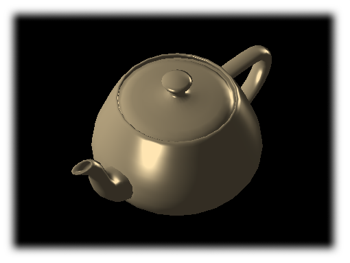

# `euc`

A 3D rendering crate that lets you write shaders in Rust.



## Example

```rust
struct Triangle;

impl Pipeline for Triangle {
    type Uniform = ();
    type Vertex = [f32; 2];
    type VsOut = ();
    type Pixel = [u8; 4];

    // Vertex shader
    fn vert(_: &Self::Uniform, pos: &Self::Vertex) -> ([f32; 3], Self::VsOut) {
        ([pos[0], pos[1], 0.0], ())
    }

    // Fragment shader
    fn frag(_: &Self::Uniform, _: &Self::VsOut) -> Self::Pixel {
        [255, 0, 0, 255] // Red
    }
}

fn main() {
    let mut color = Buffer2d::new([640, 480], [0; 4]);
    let mut depth = Buffer2d::new([640, 480], 1.0);

    Triangle::draw::<rasterizer::Triangles<_>, _>(
        &(),
        &[
            [-1.0, -1.0],
            [ 1.0, -1.0],
            [ 0.0,  1.0],
        ],
        &mut color,
        &mut depth,
    );
}
```

See `examples/` for more code example.

## What is `euc`?

`euc` is a versatile, simple to use crate that allows 3D rendering on the CPU.

## Why?

- Modern graphics APIs are complex, verbose beasts. Rendering with the CPU means less complexity, less boilerplate and less verbosity: perfect for testing ideas.

- Modern CPUs are fast enough to make simple 3D programs run at reasonable speeds (although they are of course no match for GPUs).

- Not requiring a GPU interface means that `euc` is incredibly portable. As a result, `euc` is `no_std`.

## Release Mode

Cargo, by default, compiles Rust code in debug mode.
In this mode, very few optimisations are made upon the code, and as a result the performance of software rendering tends to suffer.
To experience this project with good performance, make sure to compile with the `--release` flag.

## `no_std`

`euc` can be compiled on platforms that lack standard library supports. This makes it ideal for rendering 3D graphics on embedded devices.
You can enable `no_std` support by enabling the `no_std` feature in your `Cargo.toml` file like so:

```
[dependencies]
euc = { version = "x.y.z", features = ["no_std"] }
```

## Goals

- Support programmable shaders written in Rust

- Support common pipeline features such as texture samplers, multiple rendering passes, uniform data, etc.

- Simple, elegant interface that scales well

- Correctness

## Non-Goals

- Extreme optimisation (although obvious low-hanging fruit will be picked)

- Compliance/compatibility with an existing API (i.e: OpenGL)

## License

`euc` is distributed under either of:

- Apache License, Version 2.0, (LICENSE-APACHE or http://www.apache.org/licenses/LICENSE-2.0)

- MIT license (LICENSE-MIT or http://opensource.org/licenses/MIT)

at the disgression of the user.
